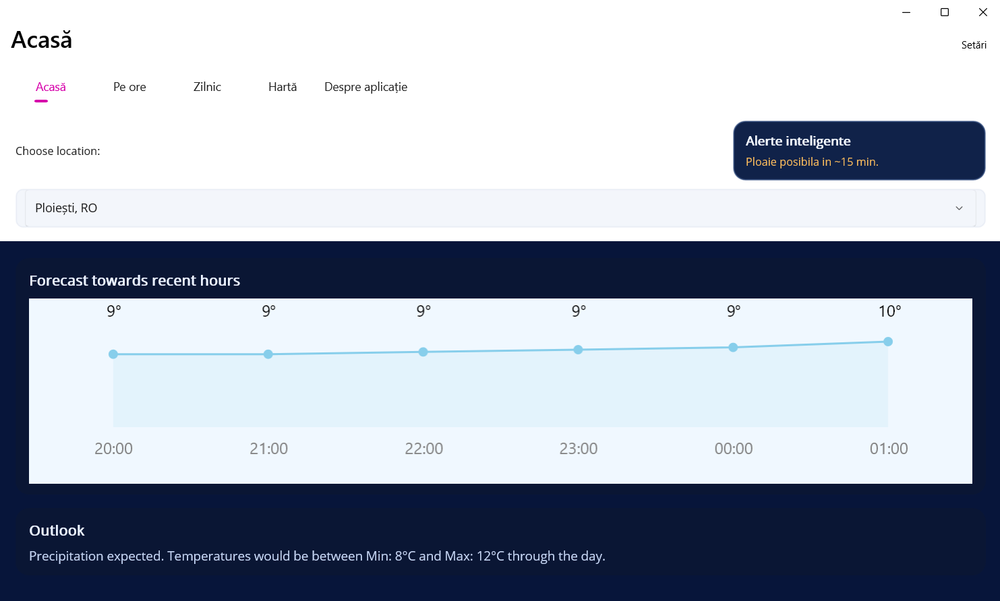
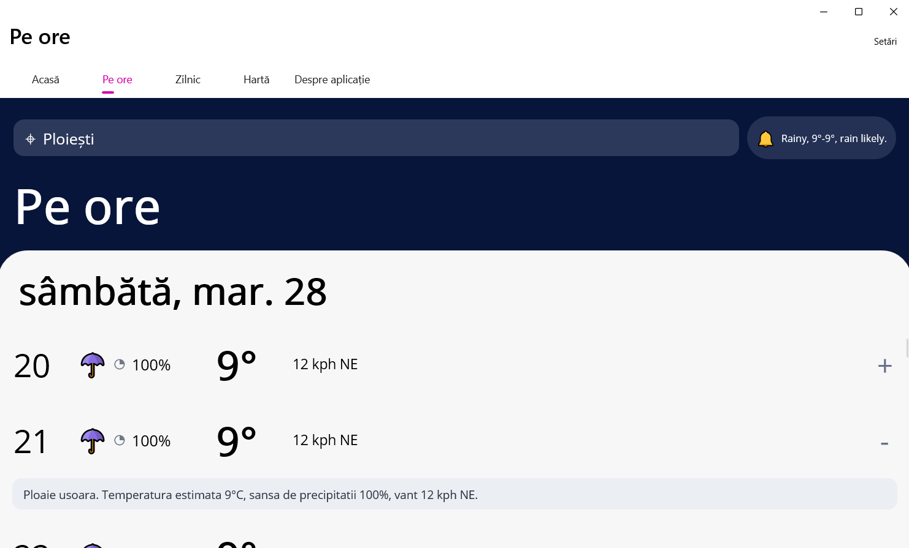
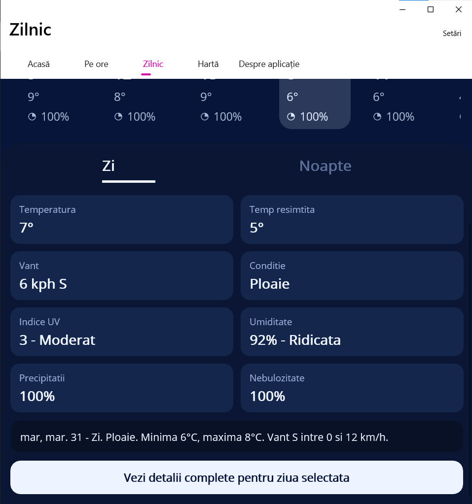
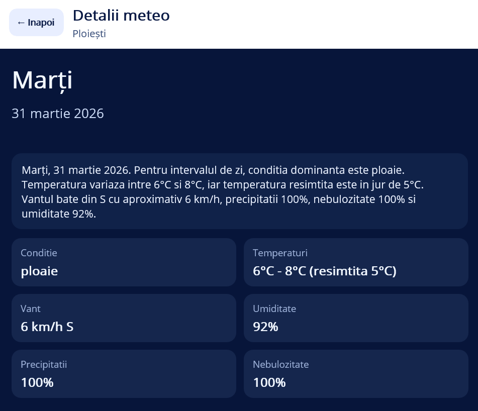
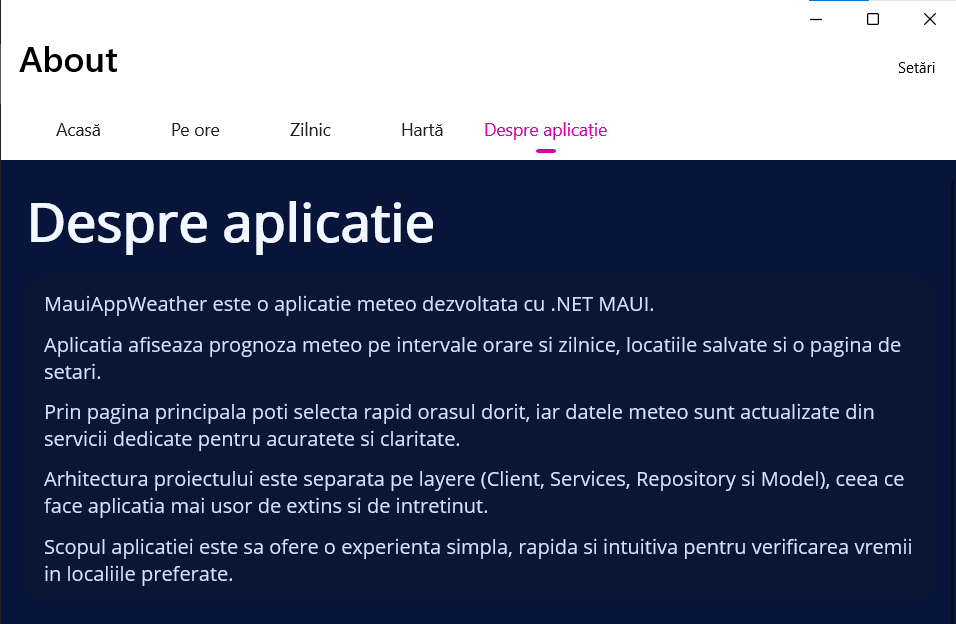
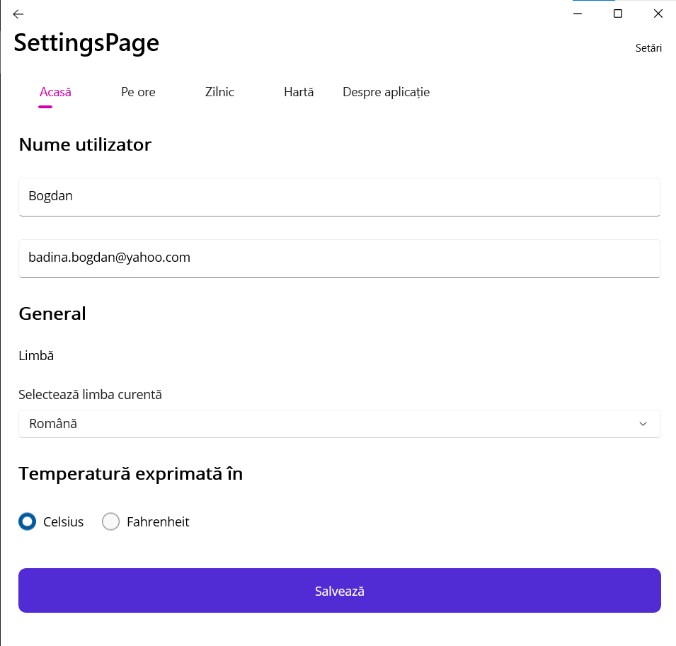

# MAUI Weather App

This repository contains a multi-project .NET MAUI weather application.

## Project Structure

- `MauiAppWeather/MauiAppWeatherClient` - MAUI client app (UI, ViewModels, navigation)
- `MauiAppWeather/MauiAppWeatherServices` - service layer for weather/settings/location logic
- `MauiAppWeather/MauiAppWeatherRepository` - repository/data access layer
- `MauiAppWeather/MauiAppWeatherModel` - shared DTO/model definitions
- `MauiAppWeather/MauiAppWeather.slnx` - solution file

## Requirements

- .NET 10 SDK
- MAUI workloads installed
- Windows (for `net10.0-windows10.0.19041.0`) or Android tooling (for `net10.0-android`)

## Run (Windows)

```powershell
dotnet build .\MauiAppWeather\MauiAppWeather.slnx -c Debug
dotnet run --project .\MauiAppWeather\MauiAppWeatherClient\MauiAppWeatherClient.csproj -f net10.0-windows10.0.19041.0
```

## Run (Android)

```powershell
dotnet build .\MauiAppWeather\MauiAppWeather.slnx -c Debug
dotnet run --project .\MauiAppWeather\MauiAppWeatherClient\MauiAppWeatherClient.csproj -f net10.0-android
```

## Screenshots

Aceste capturi prezinta fluxul principal al aplicatiei, de la selectarea rapida a locatiei pana la detalii zilnice complete.
Interfata pune accent pe claritate, folosind carduri, alerte vizibile si navigare simpla intre tab-uri.
Pagini precum `Settings` si `About` completeaza experienta prin optiuni de personalizare si informatii despre proiect.

### Home



### Hourly Forecast



### Daily Forecast



### Weather Details



### About



### Settings



## License

This project is distributed under the terms described in [EULA.md](./EULA.md).
